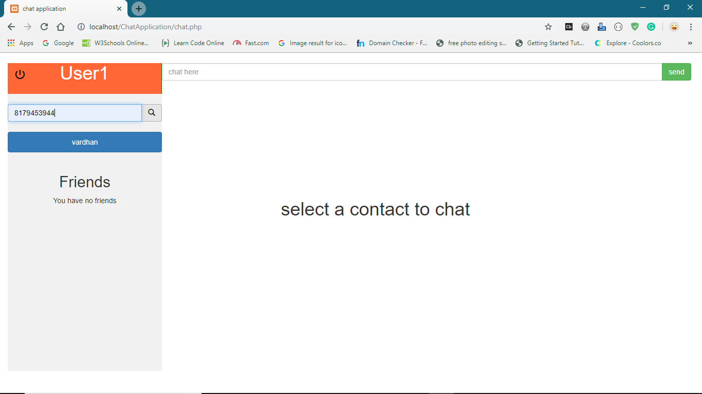
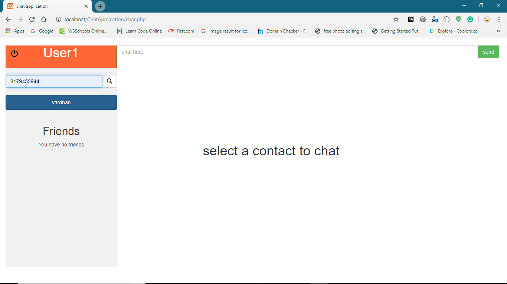
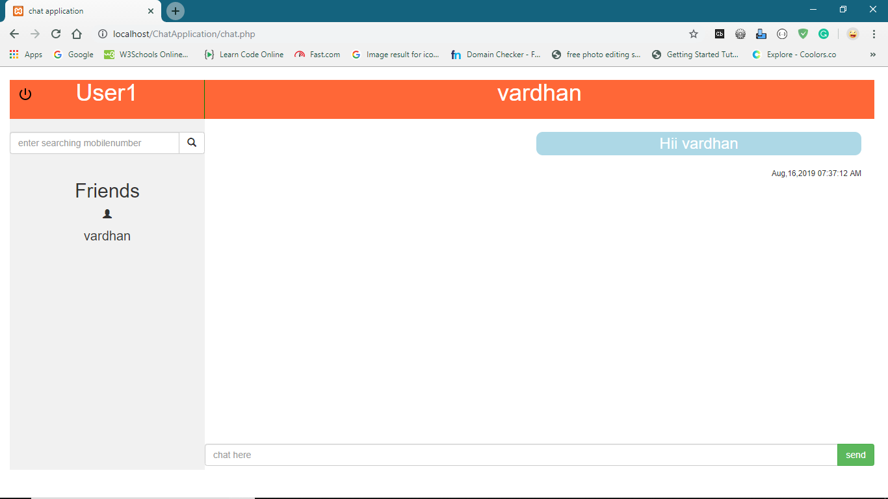
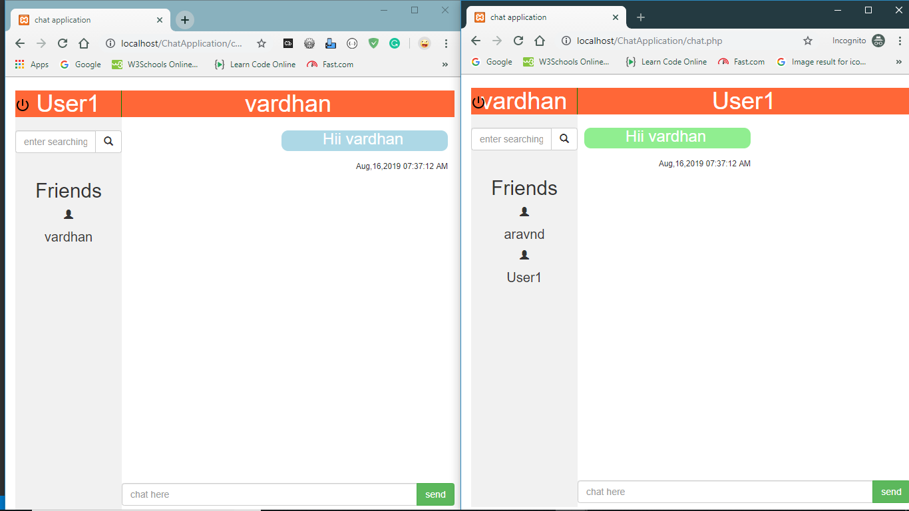
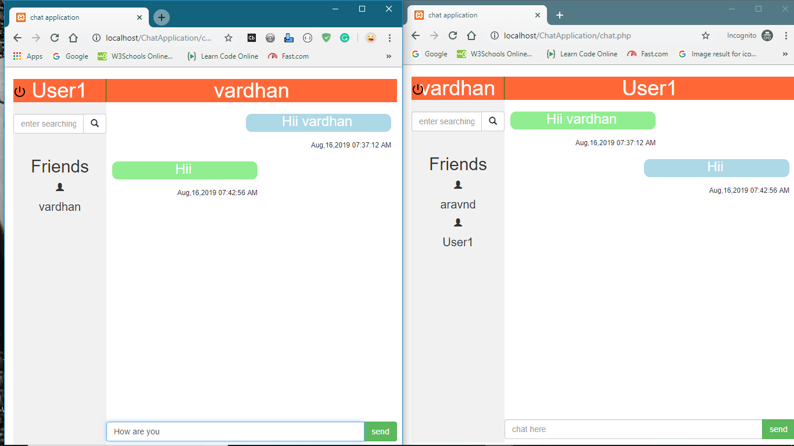
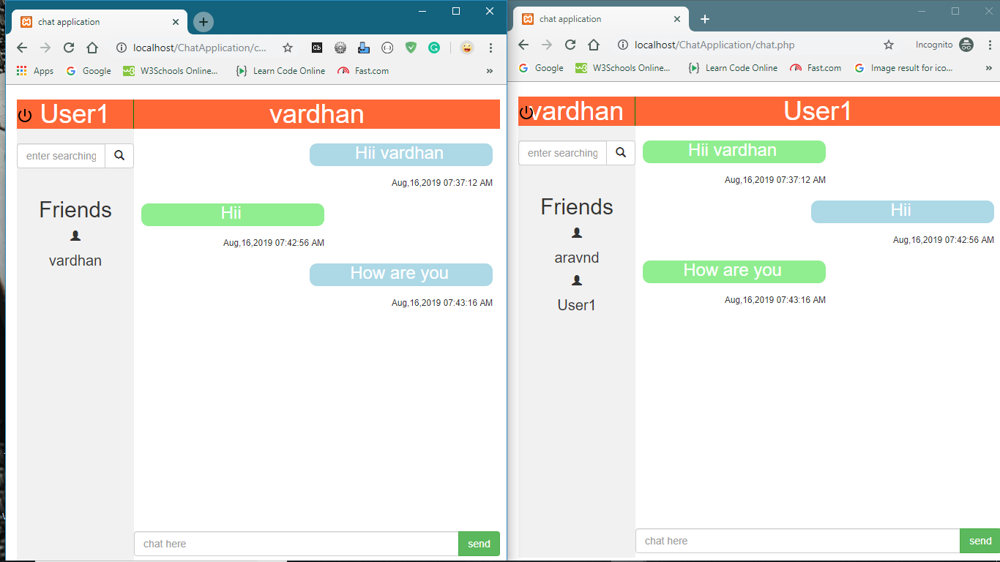

# FriendAmi (The Chat Application)

## User Reistration

### Step1 : Homepage of Friendami application is here

### Step2 : Registration using adding required details

### Step3 : Login again with those details to enter into your chat screen

## Adding new Friends

### Step1 : Search for a particular phone number

### Step2 : click on addfreind

### Step3 : Start conversation to add him/his to your friend

## Hangout with friends

### Step1 : Check that chat is appeared or not

### Step2 : Chat with your friend

### Step3 : Check that can appear in your friend chatscreen simultaneously

